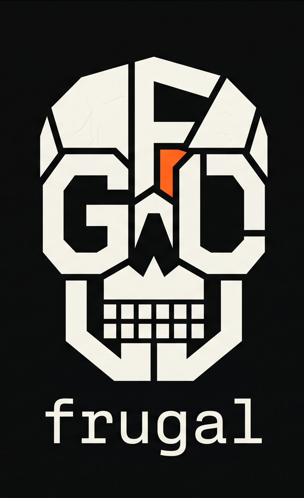

<!--
Logo
----
Drop your logo at `docs/assets/logo.png` and update the `src=` below if needed.
Portrait logos: prefer setting `height=` (not `width=`) to preserve aspect ratio.
-->
<p align="center">
  
</p>

<p align="center">
  <strong>Deterministic context packing for open-source AI workflows.</strong>
</p>

<p align="center">
  `fgl` assembles repo context in a stable order so repeated prompts stay cacheable and cheap.
</p>

<p align="center">
  <a href="https://github.com/jeverett32/frugal/actions/workflows/ci.yml">
    
  </a>
  <a href="https://github.com/jeverett32/frugal/releases">
    
  </a>
  <a href="#license">
    
  </a>
  <a href="https://www.rust-lang.org/">
    
  </a>
</p>

<p align="center">
  <a href="#install">Install</a> &bull;
  <a href="#problem">Problem</a> &bull;
  <a href="#how-frugal-solves-it">How It Works</a> &bull;
  <a href="#quick-start">Quick Start</a> &bull;
  <a href="/home/everjohn/projects/frugal/docs/BENCHMARKS.md">Benchmarks</a> &bull;
  <a href="#config">Config</a> &bull;
  <a href="/home/everjohn/projects/frugal/CONTRIBUTING.md">Contributing</a>
</p>

`frugal` is a local CLI for assembling AI context in a stable order:

1. Foundation
2. Secondary Skeletons
3. Active Zone

It is built for workflows where **you control the prompt** — opencode, aider, raw API calls, web UIs, local models. It is not a proxy. It does not send network requests. It does not sit between you and a model provider.

It gives you a deterministic `CONTEXT.md` or stdout stream that is easier to cache, cheaper to resend, and easier to reason about.

## Install

Recommended one-line install from GitHub Releases:

```bash
curl -fsSL https://raw.githubusercontent.com/jeverett32/frugal/main/scripts/install.sh | bash
```

This installs `fgl` into `~/.local/bin` by default.

Windows PowerShell install:

```powershell
irm https://raw.githubusercontent.com/jeverett32/frugal/main/scripts/install.ps1 | iex
```

This installs `fgl.exe` into `%USERPROFILE%\.local\bin` by default.

Cargo install:

```bash
cargo install --git https://github.com/jeverett32/frugal --tag v0.3.0
```

Local checkout install:

```bash
cargo install --path .
```

Verify:

```bash
fgl --version
fgl --help
```

After install, `fgl` is global for your user account, so you can run it inside any repo:

```bash
cd /path/to/any/project
fgl init
```

Windows manual fallback:

- download `frugal-v0.3.0-x86_64-pc-windows-msvc.zip` from Releases
- extract `fgl.exe`
- place it in a directory on your `PATH`
- verify with `fgl --version`

## Uninstall

Linux / macOS:

```bash
curl -fsSL https://raw.githubusercontent.com/jeverett32/frugal/main/scripts/uninstall.sh | bash
```

Windows PowerShell:

```powershell
irm https://raw.githubusercontent.com/jeverett32/frugal/main/scripts/uninstall.ps1 | iex
```

Cargo install:

```bash
cargo uninstall frugal
```

Manual removal — delete the binary directly:

```bash
rm ~/.local/bin/fgl          # Linux / macOS default
```

```powershell
Remove-Item "$HOME\.local\bin\fgl.exe"   # Windows default
```

The scripts only remove the `fgl` binary. Per-repo `.fgl/` directories and `~/.local/share/fgl/` (global gain registry) are left intact. Remove them manually if wanted:

```bash
rm -rf .fgl/                          # remove repo state
rm -rf ~/.local/share/fgl/            # remove global gain registry
```

## Problem

When you control the prompt — opencode, aider, raw API calls, web UIs, local models — repeated context is expensive.

A typical loop looks like this:

1. assemble broad repo context
2. change one or two active files
3. reassemble the same broad context again
4. repeat all day

The problem is that the expensive part of the prompt barely changed, but the context gets rebuilt or reordered every run. That breaks provider-side caching and you pay full price each time.

That hurts in three ways:

- **cost:** you keep paying for the same large prefix
- **latency:** large prompts take longer to process
- **cache misses:** tiny ordering changes break provider-side prompt caching

For many providers, cached input can be around a **90% discount** versus uncached. The exact discount depends on provider and model, but the principle is the same:

> if the prefix stays stable, repeated calls get much cheaper

> **Note:** fully agentic tools like Claude Code and Codex manage their own context and caching. `frugal` is built for workflows where you are the one assembling the prompt.

## Simple Mental Model

Without `frugal`:

```text
[big raw repo context + docs + active files]
one unstable blob
small edits can reshuffle the whole prompt
```

With `frugal`:

```text
[Foundation + Secondary Skeletons] [Active Zone]
 stable prefix                  volatile tail
```

<!--
Screenshot idea: before/after pack layout
Good place for a simple diagram screenshot or terminal capture showing `fgl pack` output headings.
Add: `docs/assets/screenshots/slabs.png`
Then uncomment:

-->

That is the core bet:

- keep most of the prompt stable
- keep broad repo context compact
- let active file churn stay at the end

## Theoretical Solution

The theoretical solution is simple:

1. keep the prompt prefix as stable as possible
2. push volatile content to the end
3. only send raw source where exact body text matters

If you can hold most of the prompt constant across requests, then the provider can recognize and reuse cached prefix work instead of charging full price for the same context over and over.

That means the right abstraction is not “read fewer files.”

It is:

- keep **stable context** first
- keep **broad context** compact
- keep **changing context** last

## How `frugal` Solves It

`frugal` turns that caching idea into a concrete context format.

It separates repo state into three slabs:

### 1. Foundation

Pinned files that should stay first and stay stable.

Examples:

- `AGENTS.md`
- `CLAUDE.md`
- other high-value project docs you choose to pin

### 2. Secondary Skeletons

Compact structural summaries of the broader codebase.

Instead of shipping full file bodies for every relevant source file, `frugal` extracts high-signal structure:

- function and method signatures
- classes, structs, interfaces, enums, traits, type aliases
- attached docs where supported
- top-level constants and declarations

This keeps orientation value while cutting prompt bulk.

### 3. Active Zone

Raw file bodies for the files you are actively editing.

This is the volatile tail of the prompt. It changes often, so `frugal` keeps it last on purpose.

## Why This Layout Matters

This layout is meant to increase cacheable prefix stability:

- **Foundation** changes rarely
- **Secondary Skeletons** change less often than raw full-source context
- **Active Zone** absorbs most day-to-day churn

So instead of rebuilding one giant unstable blob, you get:

- a stable prefix
- a compact middle layer
- a volatile tail

That is the core economic idea behind `frugal`.

## Who This Is For

`frugal` is built for workflows where you assemble the prompt yourself:

- **opencode** — context goes into the prompt as a blob; stable ordering = cache hits
- **aider** — you control what context gets sent each session
- **raw API calls** — building prompts programmatically or in scripts
- **web UIs** — pasting context into Claude, ChatGPT, or similar
- **local models** — tight context windows where every token counts

`frugal` is probably not worth it if you:

- use Claude Code, Codex, or similar fully agentic tools — they manage context and caching themselves
- only work in tiny repos
- mostly do one-off prompts where caching doesn't compound

## Why Not Just Read Files Directly?

Because raw file reading solves a different problem.

Reading files directly gives exact source.

`frugal` is trying to optimize repeated context economics:

- broad context should be compact
- stable context should stay stable
- exact raw source should be reserved for active work

You still read raw files when you need them. `frugal` just stops treating every prompt like a full repo dump.

## What `frugal` Is Not

- not a proxy
- not a model router
- not a network service
- not a TUI
- not a magic “cache hit guarantee”

It is a deterministic local packer that makes cache-friendly prompt structure easier to produce on purpose.

## What `fgl` Does

### `fgl init`

Bootstraps repo for `frugal` use.

- creates `.fgl/config.toml`
- pins `AGENTS.md` and `CLAUDE.md` into Foundation by default
- writes managed instructions into `AGENTS.md` and `CLAUDE.md`
- safe to rerun

### `fgl pack [PATH...]`

Builds markdown context pack in fixed order:

1. Foundation
2. Secondary Skeletons
3. Active Zone

Output goes to stdout by default or to a file with `--output`.

### `fgl status [PATH...]`

Prints one-line pack summary:

```text
prefix=123 active=18 ratio=6.83 files=27 langs=4
```

Token estimate uses `ceil(bytes / 4)`.

<!--
Screenshot idea: `fgl status` output
Add: `docs/assets/screenshots/status.png`
Then uncomment:

-->

### `fgl gain`

Reports estimated token savings from pack history.

History is written to `.fgl/history.jsonl` after each successful `fgl pack`. Metrics are derived from actual pack runs — not billing APIs or proxy telemetry.

Default view (repo scope):

```bash
fgl gain
```

```text
FGL Estimated Savings (Repo Scope)
=================================

Total packs:      12
Raw tokens:       87432
Pack tokens:      38201
Tokens saved:     49231
Savings rate:     █████████░  56.33%
Prefix tokens:    32100
Active tokens:    6101

Top Active Files
----------------
1. src/gain.rs (8)
2. src/cli.rs (5)
3. README.md (3)
```

Show recent runs:

```bash
fgl gain --history --limit 5
```

Machine-readable JSON:

```bash
fgl gain --json
```

Global aggregate across all registered repos:

```bash
fgl gain --global
```

```text
FGL Estimated Savings (Global Scope)
====================================

Repo                             Packs         Saved  Rate
-------------------------------  -----  ------------  ----------
/home/user/projects/frugal          12        49231   █████████░  56.33%
/home/user/projects/other            3         8100   ████░░░░░░  42.10%

TOTAL                               15        57331   ████████░░  53.87%
(2 repos)
```

Repos are registered automatically the first time `fgl pack` runs in each repo. No daemon, no network, no background process.

Global JSON output:

```bash
fgl gain --global --json
```

Flags:

| Flag | Description |
|---|---|
| `--history` | Show recent pack runs below the summary |
| `--limit N` | Cap recent runs and top files (default 10) |
| `--json` | Emit machine-readable JSON |
| `--global` | Aggregate across all registered repos |

## Quick Start

Initialize repo once:

```bash
fgl init
```

Check current pack shape:

```bash
fgl status src/main.rs
```

Write context file:

```bash
fgl pack --output CONTEXT.md src/main.rs src/lib.rs
```

Pipe directly:

```bash
fgl pack src/main.rs src/lib.rs
```

## Screenshots

Add screenshots under `docs/assets/screenshots/` and uncomment the images below.

### `fgl pack` command + output

Shows how you build a deterministic pack and where it goes.

<!--
Add: `docs/assets/screenshots/pack.png`
Then uncomment:

-->

### Generated `CONTEXT.md` structure

Shows the three slabs (Foundation / Secondary Skeletons / Active Zone) in the final markdown.

<!--
Add: `docs/assets/screenshots/context.png`
Then uncomment:

-->

### `fgl gain` summary

Shows estimated savings over time and top active files.

<!--
Add: `docs/assets/screenshots/gain.png`
Then uncomment:

-->

## Example Workflow

Typical loop with opencode, aider, or a raw API script:

1. run `fgl init` once per repo to set up Foundation and config
2. run `fgl pack --output CONTEXT.md <active-files...>` before each session
3. pass `CONTEXT.md` to your tool or paste it into your prompt
4. keep Foundation stable — it forms the cacheable prefix
5. only swap out Active Zone files as your work changes

`fgl status` gives a quick token estimate before you pack:

```bash
fgl status src/main.rs
# prefix=123 active=18 ratio=6.83 files=27 langs=4
```

## Example Value

On repeated coding loops, `frugal` is trying to turn this:

- resend broad repo context every time
- pay full input price repeatedly
- lose cacheability when prompt order shifts

into this:

- keep Foundation and Skeletons stable
- change only Active Zone for small edits
- maximize chance that the provider can treat most of the prefix as cached input

Exact savings depend on provider, model, and workflow, but the economic target is straightforward:

- fewer raw repeated tokens
- more stable cached prefix
- less prompt churn from small edits

To generate real numbers on your own repos, see [docs/BENCHMARKS.md](/home/everjohn/projects/frugal/docs/BENCHMARKS.md).

## Config

Default config:

```toml
version = 1

[foundation]
pinned = ["AGENTS.md", "CLAUDE.md"]

[languages]
enabled = ["python", "rust", "javascript", "typescript", "go", "html", "css", "yaml", "shell", "json", "markdown", "toml"]
```

<!--
Screenshot idea: `.fgl/config.toml` in a real repo
Add: `docs/assets/screenshots/config.png`
Then uncomment:

-->

Rules:

- `foundation.pinned` order is preserved
- `languages.enabled` controls which languages appear in Secondary Skeletons
- Active files always stay raw and always render last

## Language Support

Current real skeletonizers:

- Python
- Rust
- Go
- JavaScript
- TypeScript
- HTML
- CSS
- YAML
- Shell
- JSON
- Markdown
- TOML

Skeleton output focuses on high-signal structure:

- function and method signatures
- classes, structs, interfaces, enums, traits, type aliases
- attached docs where supported
- top-level constants / statics / declarations

## Output Contract

`fgl pack` renders stable markdown sections:

```text
# Foundation
# Secondary Skeletons
# Active Zone
```

Each file renders as:

````text
## `path/to/file`
```lang
...
```
````

Line endings normalize to LF before rendering. Fence width expands automatically if body content already contains backticks.

## Development

Core local checks:

```bash
cargo fmt --check
cargo clippy --all-targets -- -D warnings
cargo test
```

In this dev environment, local C compilation may also need:

```bash
export PATH="$HOME/.cargo/bin:$PATH"
export PATH="/tmp/zig-tools:$PATH"
export CFLAGS_x86_64_unknown_linux_gnu="--target=x86_64-linux-gnu.2.39"
```

## Contributing

Start with [CONTRIBUTING.md](/home/everjohn/projects/frugal/CONTRIBUTING.md).

## Security

See [SECURITY.md](/home/everjohn/projects/frugal/SECURITY.md).

## License

MIT. See [LICENSE](/home/everjohn/projects/frugal/LICENSE).
